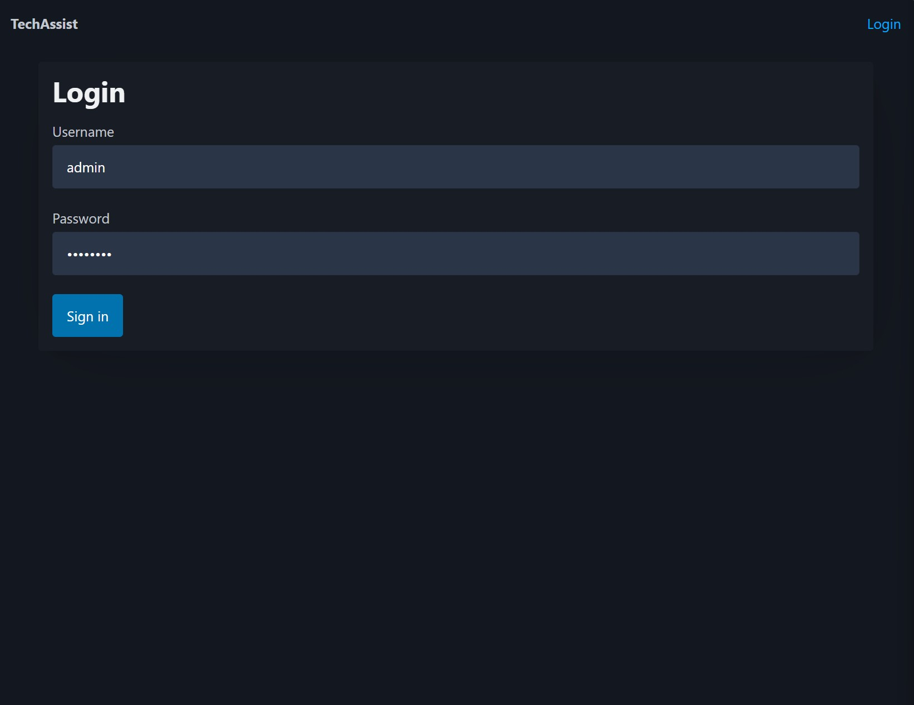
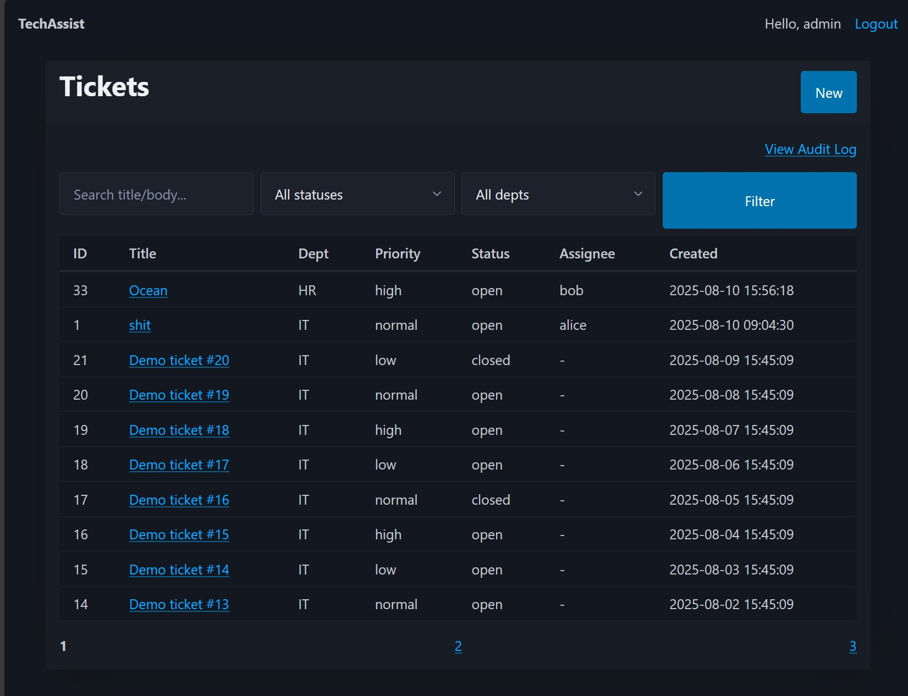
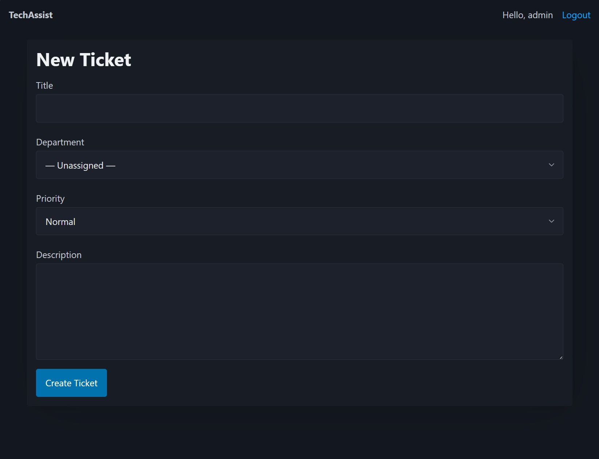
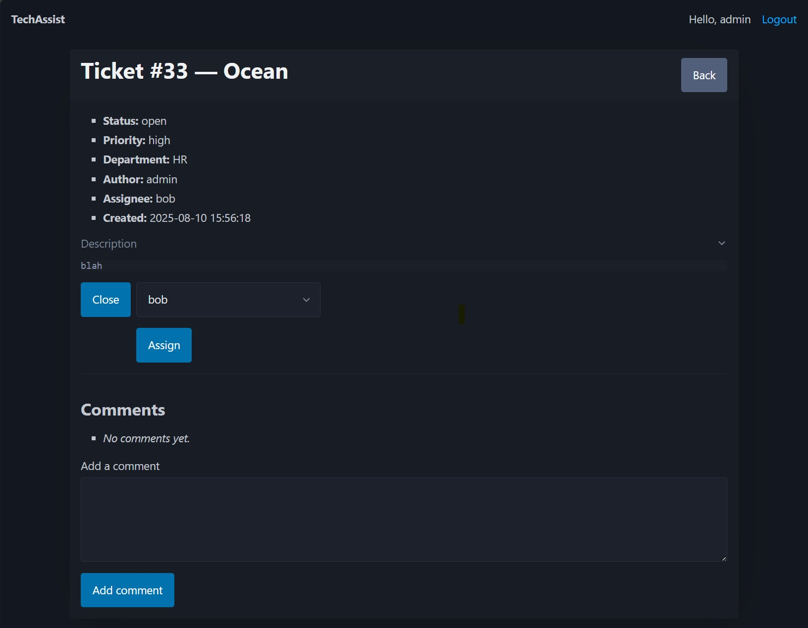
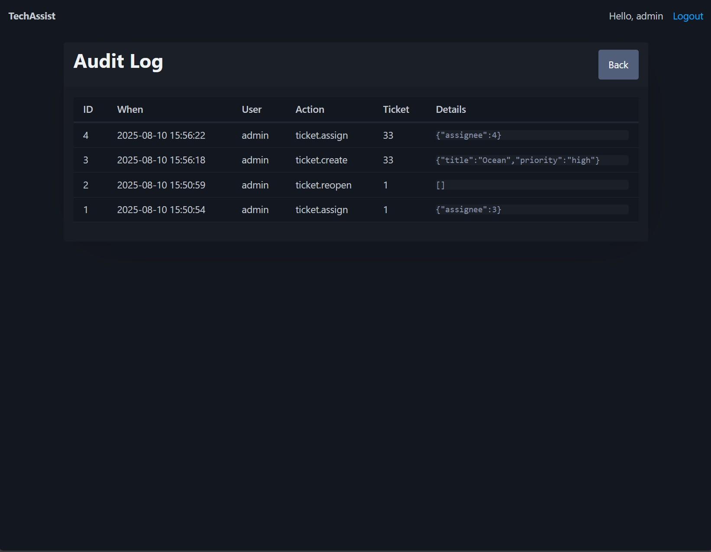

# TechAssist – Simple PHP Ticketing System

TechAssist is a lightweight IT helpdesk/ticketing system built in **vanilla PHP** (no framework) with **MySQL/MariaDB**, containerized using **Docker** for easy setup.  
It was rebuilt and modernized from an older PHP class project to serve as a clean, easy‑to‑run demonstration for full‑stack PHP development.

This project was designed for portfolio showcase purposes, particularly for roles requiring work on **existing codebases** (maintenance, feature addition, bug fixing).

---

## ✨ Features

- **Ticket CRUD** – Create, view, update ticket statuses.
- **Comments / Activity Thread** – Keep discussion per ticket.
- **Status Workflow** – Open → In Progress → Closed (with timestamps).
- **Search, Filtering & Pagination** – Quickly find tickets.
- **Flash Messages & Validation** – Feedback for all form actions.
- **Demo Data Seeder** – Populate DB with sample users/tickets.
- **Roles & Authorization** – Admin and regular users.
- **Assignment** – Assign tickets to users (admin only).
- **Audit Log** – Track every change with timestamps & actors.
- **Secure Credentials Management** – Uses `.env` (excluded from repo) for sensitive config.
- **Dockerized Environment** – PHP‑FPM, Nginx, MariaDB, phpMyAdmin.

---

## 📦 Tech Stack

- **PHP 8.x** – Core application logic (no frameworks).
- **MariaDB 10.x** – Database.
- **Nginx** – Web server.
- **Docker Compose** – Local development environment.
- **phpMyAdmin** – DB management UI.

---

## 🚀 Getting Started

### 1. Clone the repository
```bash
git clone https://github.com/MederickBernier/TechAssist.git
cd TechAssist
```

### 2. Environment Variables
Copy `.env.example` to `.env` and adjust values if needed:
```bash
cp .env.example .env
```

### 3. Start with Docker
```bash
docker compose up -d --build
```

### 4. Initialize the Database
```bash
docker compose exec -T db mariadb -utechassist -ptechassist techassist < ./sql/init/01_schema.sql
docker compose exec -T db mariadb -utechassist -ptechassist techassist < ./sql/init/02_features.sql
docker compose exec -T db mariadb -utechassist -ptechassist techassist < ./sql/init/03_seed_data.sql
```

### 5. Access the application
- **App:** http://localhost:8080  
- **phpMyAdmin:** http://localhost:8081  
  - Server: `db`  
  - User: `techassist`  
  - Pass: `techassist`

---

## 🔑 Demo Credentials

| Role   | Username | Password |
|--------|----------|----------|
| Admin  | admin    | password |
| User   | demo     | password |
| User   | alice    | password |
| User   | bob      | password |

---

## 📂 Project Structure

```
.
├── docker/                 # Docker config files
├── public/                 # Public web root
├── sql/init/                # DB schema & seed scripts
├── src/                     # PHP application code
│   ├── Controllers/         # Ticket & Auth controllers
│   ├── Models/              # Data access logic
│   ├── Views/               # HTML templates
│   └── bootstrap.php        # App bootstrap
├── .env.example             # Example environment variables
├── docker-compose.yml
└── README.md
```

---

## 📝 How to Use

1. **Login** with provided credentials.
2. Create new tickets, assign them, add comments.
3. Filter, search, and paginate ticket lists.
4. As admin, access the **Audit Log** to see all changes.
5. Manage DB from phpMyAdmin if needed.

---

## 📸 Screenshots

### Login Page


### Dashboard


### Ticket Creation


### Ticket Details


### Audit Log


---

## 📜 License

MIT – free to use, modify, and share.

---

## 🙋 Author

**Mederick Bernier**  
GitHub: [MederickBernier](https://github.com/MederickBernier)
